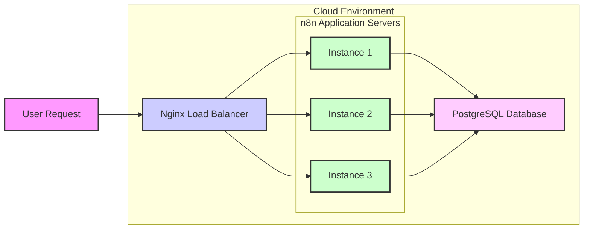

# n8n-pet
Example deployment of n8n with persistant storage
Below is an example of a comprehensive README file that includes a Mermaid diagram to illustrate the cloud-based architecture. You can use or adapt this README for your project:

---

# n8n Cloud Deployment on Jelastic

This repository demonstrates a production-ready deployment of [n8n](https://n8n.io/) on Jelastic Cloud using a three-node architecture. This setup leverages Docker containers to provide a scalable, secure, and resilient environment.

## Architecture Overview

The deployment consists of three main components:

- **Load Balancer:** Uses Nginx to distribute incoming traffic.
- **Application Server:** Runs the n8n workflow automation tool (using the `n8nio/n8n` Docker image).
- **PostgreSQL Database:** Provides persistent storage for workflows and credentials.

Below is a Mermaid diagram representing the architecture:



## Features

- **Secure Deployment:**  
  Sensitive data is encrypted using a consistent `N8N_ENCRYPTION_KEY`.

- **Scalable Architecture:**  
  A load balancer (Nginx) efficiently distributes traffic, while PostgreSQL ensures data persistence.

- **Enhanced Reliability:**  
  Task runners are enabled to process workflows reliably, and the reverse proxy settings are configured for accurate rate limiting.

## Prerequisites

- **Docker & Docker Compose:** Installed on your local development machine.
- **Jelastic Cloud Account:** For production deployment.
- **Domain Name & SSL Certificate:** (Optional) For a production-grade deployment.
- **PostgreSQL Credentials:** As specified in the configuration.

## Deployment Instructions

### Local Deployment with Docker Compose

1. **Clone the Repository:**

   ```bash
   git clone https://github.com/yourusername/n8n-cloud-deployment.git
   cd n8n-cloud-deployment
   ```

2. **Create a `.env` File:**

   Create a file named `.env` in the project root with the following content:

   ```env
   DB_TYPE=postgresdb
   DB_POSTGRESDB_HOST=postgres
   DB_POSTGRESDB_PORT=5432
   DB_POSTGRESDB_DATABASE=n8n
   DB_POSTGRESDB_USER=n8n
   DB_POSTGRESDB_PASSWORD=secret

   # Enforce strict settings file permissions
   N8N_ENFORCE_SETTINGS_FILE_PERMISSIONS=true

   # Enable task runners to avoid deprecation warnings
   N8N_RUNNERS_ENABLED=true

   # Trust reverse proxy headers (fixes X-Forwarded-For error)
   N8N_TRUST_PROXY=true

   # Set a custom encryption key to ensure credentials are decryptable
   N8N_ENCRYPTION_KEY=yourCustomEncryptionKey123
   ```

3. **Start the Services:**

   ```bash
   docker-compose up -d
   ```

4. **Access the n8n Editor:**

   Open your browser and navigate to [http://localhost:5678](http://localhost:5678).

### Deployment on Jelastic

1. **Log in to Jelastic:**

   Access your Jelastic Cloud dashboard using your provider-specific URL.

2. **Import the Docker Compose File:**

   Use the “Import Docker Compose” feature in the Jelastic dashboard to upload your `docker-compose.yml` file.

3. **Configure Environment Variables:**

   Ensure all required environment variables (as listed in the `.env` file above) are set in your Jelastic environment configuration.

4. **Deploy the Environment:**

   Click “Deploy” and monitor the deployment process through the Jelastic dashboard.

5. **Domain & SSL Configuration (Optional):**

   - Map your domain name to the load balancer node.
   - Configure SSL using Jelastic’s integrated SSL management or manually install certificates.

## Troubleshooting

### X-Forwarded-For Header Error

If you see an error similar to:

```
ValidationError: The 'X-Forwarded-For' header is set but the Express 'trust proxy' setting is false...
```

Make sure the environment variable `N8N_TRUST_PROXY=true` is set.

### Credential Decryption Error

If you encounter errors like:

```
Credentials could not be decrypted. The likely reason is that a different "encryptionKey" was used...
```

- **Restore the Original Key:**  
  If you have previously used a custom encryption key, ensure that the same key is set in your environment.
  
- **Clear and Re-enter Credentials:**  
  If the original key is lost, you can remove problematic credentials manually and re-enter them via the n8n UI.  
  *For PostgreSQL:*
  1. Connect to your PostgreSQL container:
     ```bash
     docker exec -it <postgres_container_name> psql -U n8n -d n8n
     ```
  2. List credentials:
     ```sql
     SELECT id, name FROM credentials_entity;
     ```
  3. Delete the problematic credential:
     ```sql
     DELETE FROM credentials_entity WHERE id = 'the-problematic-id';
     ```
  4. Exit with `\q` and reconfigure the credentials in the n8n UI.

## License

This project is licensed under the [GNU License](LICENSE).

## Contributing

Contributions are welcome! Please open issues or submit pull requests for improvements.

---

Happy automating with n8n!
